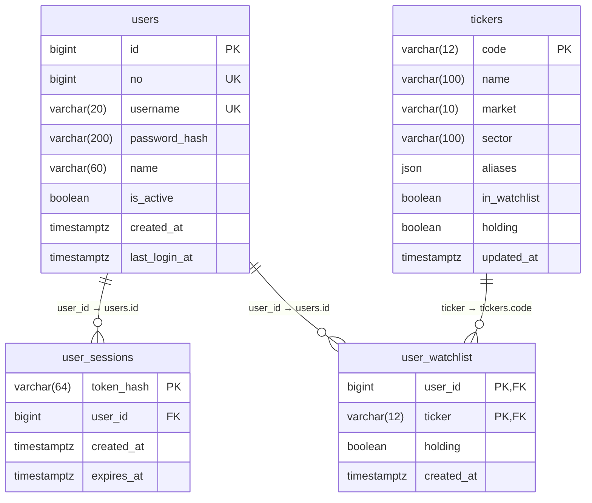
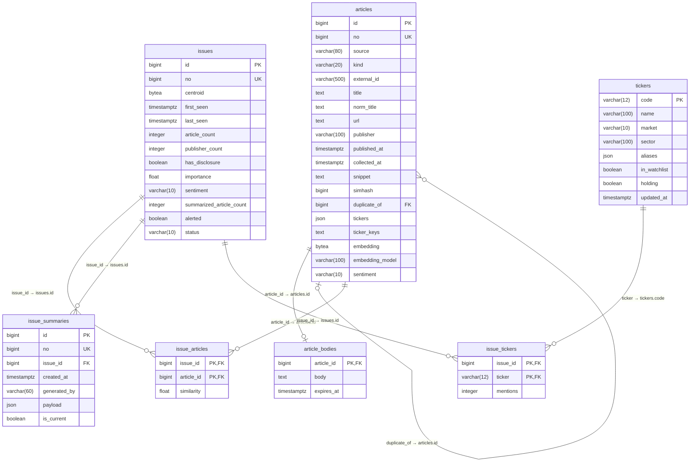
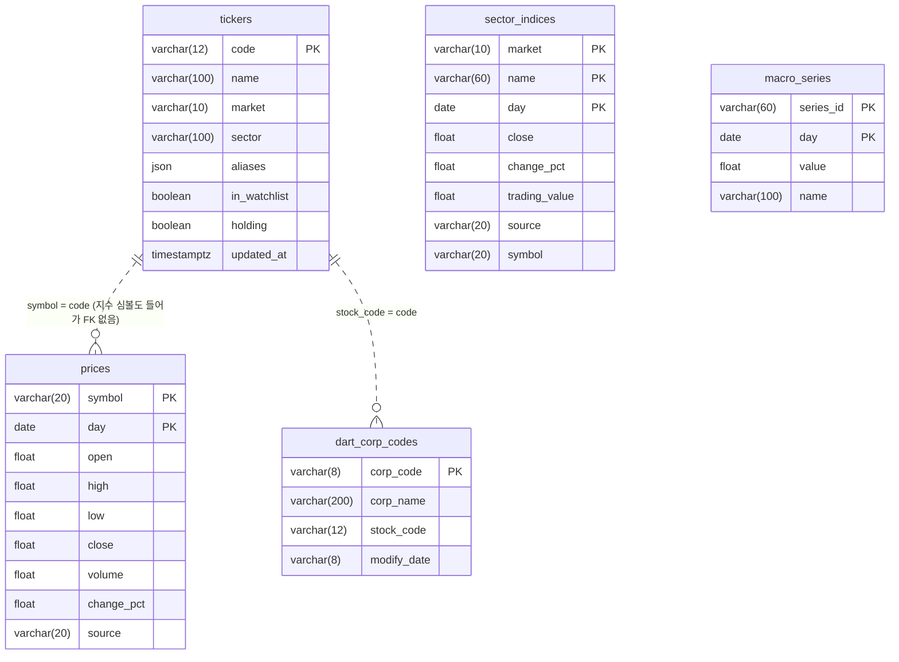
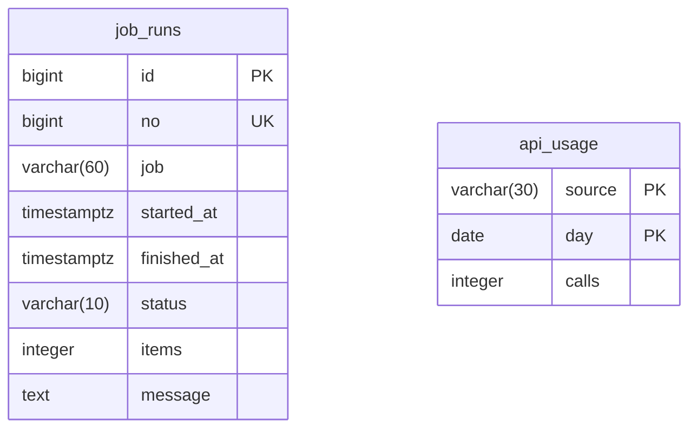

# DB ERD

> **자동 생성 문서 — 직접 고치지 마세요.** `src/issue_stream/db/models.py` 를 바꾼 뒤
> `issue-stream erd` 로 다시 만들고 함께 커밋합니다. 어긋나면 `pytest` 가 실패합니다.

- 타입은 PostgreSQL 기준. SQLite 에서도 같은 구조로 만들어진다 (bigint PK → INTEGER 자동 증가).
- **id / no**: `users`, `articles`, `issues`, `issue_summaries`, `job_runs` 의 `id` 는 내부 PK (시퀀스 `seq_<테이블>_id`, FK 는 이 값만 참조), `no` 는 화면·API 에 보이는 번호 (시퀀스 `seq_<테이블>_no`, UNIQUE).
- 매핑 테이블(`user_watchlist`, `issue_articles`, `issue_tickers`)은 시퀀스 없이 FK 복합키.
- 실선 = FK, 점선 = FK 없는 논리 관계.

## 목차

- [계정·관심종목](#계정관심종목)
- [뉴스·이슈](#뉴스이슈)
- [시세·지표](#시세지표)
- [운영](#운영)
- [테이블 상세](#테이블-상세)
- [시퀀스](#시퀀스)

## 계정·관심종목

## 뉴스·이슈

## 시세·지표

## 운영

## 테이블 상세

### `users`

로그인 계정. 가입 화면(/signup) 또는 `issue-stream user add` 로 만든다.

| 컬럼 | 타입 | 키 | NULL | 기본값 | 참조 | 설명 |
|---|---|---|---|---|---|---|
| `id` | bigint | PK |  | nextval('seq_users_id') |  | 내부 PK (FK 전용, 화면에 노출하지 않음) |
| `no` | bigint | UK |  | nextval('seq_users_no') |  | 화면·API 에 보이는 번호 |
| `username` | varchar(20) | UK |  |  |  | 로그인 ID (소문자로 저장) |
| `password_hash` | varchar(200) |  |  |  |  |  |
| `name` | varchar(60) |  | Y |  |  |  |
| `is_active` | boolean |  |  | True |  |  |
| `created_at` | timestamptz |  |  | (앱에서 계산) |  |  |
| `last_login_at` | timestamptz |  | Y |  |  |  |

### `user_sessions`

로그인 세션. 토큰 원문은 저장하지 않고 SHA-256 해시만 남긴다.

| 컬럼 | 타입 | 키 | NULL | 기본값 | 참조 | 설명 |
|---|---|---|---|---|---|---|
| `token_hash` | varchar(64) | PK |  |  |  |  |
| `user_id` | bigint | FK |  |  | users.id (CASCADE) |  |
| `created_at` | timestamptz |  |  | (앱에서 계산) |  |  |
| `expires_at` | timestamptz |  |  |  |  |  |

제약·인덱스: INDEX (expires_at) · INDEX (user_id)

### `user_watchlist`

계정별 관심종목 (☆ 로 등록).

| 컬럼 | 타입 | 키 | NULL | 기본값 | 참조 | 설명 |
|---|---|---|---|---|---|---|
| `user_id` | bigint | PK FK |  |  | users.id (CASCADE) |  |
| `ticker` | varchar(12) | PK FK |  |  | tickers.code |  |
| `holding` | boolean |  |  | False |  |  |
| `created_at` | timestamptz |  |  | (앱에서 계산) |  |  |

### `tickers`

종목 마스터 (태깅 사전). in_watchlist·holding 은 yaml + 계정별 관심종목에서 계산한 수집 대상 표시.

| 컬럼 | 타입 | 키 | NULL | 기본값 | 참조 | 설명 |
|---|---|---|---|---|---|---|
| `code` | varchar(12) | PK |  |  |  |  |
| `name` | varchar(100) |  |  |  |  |  |
| `market` | varchar(10) |  | Y |  |  |  |
| `sector` | varchar(100) |  | Y |  |  |  |
| `aliases` | json |  |  | (앱에서 계산) |  |  |
| `in_watchlist` | boolean |  |  | False |  |  |
| `holding` | boolean |  |  | False |  |  |
| `updated_at` | timestamptz |  | Y | (앱에서 계산) |  |  |

제약·인덱스: INDEX (name)

### `articles`

수집한 뉴스·공시 1건. 저작권 대응으로 제목·요약문·링크만 저장.

| 컬럼 | 타입 | 키 | NULL | 기본값 | 참조 | 설명 |
|---|---|---|---|---|---|---|
| `id` | bigint | PK |  | nextval('seq_articles_id') |  | 내부 PK (FK 전용, 화면에 노출하지 않음) |
| `no` | bigint | UK |  | nextval('seq_articles_no') |  | 화면·API 에 보이는 번호 |
| `source` | varchar(80) |  |  |  |  |  |
| `kind` | varchar(20) |  |  | 'news' |  |  |
| `external_id` | varchar(500) |  |  |  |  |  |
| `title` | text |  |  |  |  |  |
| `norm_title` | text |  |  |  |  |  |
| `url` | text |  |  |  |  |  |
| `publisher` | varchar(100) |  | Y |  |  |  |
| `published_at` | timestamptz |  |  |  |  |  |
| `collected_at` | timestamptz |  |  | (앱에서 계산) |  |  |
| `snippet` | text |  | Y |  |  |  |
| `simhash` | bigint |  |  |  |  |  |
| `duplicate_of` | bigint | FK | Y |  | articles.id (SET NULL) |  |
| `tickers` | json |  |  | (앱에서 계산) |  |  |
| `ticker_keys` | text |  |  | '' |  |  |
| `embedding` | bytea |  | Y |  |  |  |
| `embedding_model` | varchar(100) |  | Y |  |  |  |
| `sentiment` | varchar(10) |  | Y |  |  |  |

제약·인덱스: UNIQUE (source, external_id) · INDEX (published_at) · INDEX (simhash) · INDEX (source)

### `article_bodies`

본문 임시 저장소. FETCH_ARTICLE_BODY=true 일 때만 채워지고 TTL 후 삭제된다.

| 컬럼 | 타입 | 키 | NULL | 기본값 | 참조 | 설명 |
|---|---|---|---|---|---|---|
| `article_id` | bigint | PK FK |  |  | articles.id (CASCADE) |  |
| `body` | text |  |  |  |  |  |
| `expires_at` | timestamptz |  |  |  |  |  |

제약·인덱스: INDEX (expires_at)

### `issues`

같은 사건을 다룬 기사 묶음 (이슈 카드 1장).

| 컬럼 | 타입 | 키 | NULL | 기본값 | 참조 | 설명 |
|---|---|---|---|---|---|---|
| `id` | bigint | PK |  | nextval('seq_issues_id') |  | 내부 PK (FK 전용, 화면에 노출하지 않음) |
| `no` | bigint | UK |  | nextval('seq_issues_no') |  | 화면·API 에 보이는 번호 |
| `centroid` | bytea |  | Y |  |  |  |
| `first_seen` | timestamptz |  |  |  |  |  |
| `last_seen` | timestamptz |  |  |  |  |  |
| `article_count` | integer |  |  | 0 |  |  |
| `publisher_count` | integer |  |  | 0 |  |  |
| `has_disclosure` | boolean |  |  | False |  |  |
| `importance` | float |  |  | 0.0 |  |  |
| `sentiment` | varchar(10) |  | Y |  |  |  |
| `summarized_article_count` | integer |  |  | 0 |  |  |
| `alerted` | boolean |  |  | False |  |  |
| `status` | varchar(10) |  |  | 'active' |  |  |

제약·인덱스: INDEX (first_seen) · INDEX (importance) · INDEX (last_seen)

### `issue_articles`

이슈 ↔ 기사 매핑.

| 컬럼 | 타입 | 키 | NULL | 기본값 | 참조 | 설명 |
|---|---|---|---|---|---|---|
| `issue_id` | bigint | PK FK |  |  | issues.id (CASCADE) |  |
| `article_id` | bigint | PK FK |  |  | articles.id (CASCADE) |  |
| `similarity` | float |  |  | 1.0 |  |  |

### `issue_tickers`

이슈 ↔ 종목 매핑 (언급 횟수).

| 컬럼 | 타입 | 키 | NULL | 기본값 | 참조 | 설명 |
|---|---|---|---|---|---|---|
| `issue_id` | bigint | PK FK |  |  | issues.id (CASCADE) |  |
| `ticker` | varchar(12) | PK FK |  |  | tickers.code |  |
| `mentions` | integer |  |  | 1 |  |  |

### `issue_summaries`

이슈 요약 이력. provider 별 결과를 남기고 is_current 가 현재 요약.

| 컬럼 | 타입 | 키 | NULL | 기본값 | 참조 | 설명 |
|---|---|---|---|---|---|---|
| `id` | bigint | PK |  | nextval('seq_issue_summaries_id') |  | 내부 PK (FK 전용, 화면에 노출하지 않음) |
| `no` | bigint | UK |  | nextval('seq_issue_summaries_no') |  | 화면·API 에 보이는 번호 |
| `issue_id` | bigint | FK |  |  | issues.id (CASCADE) |  |
| `created_at` | timestamptz |  |  | (앱에서 계산) |  |  |
| `generated_by` | varchar(60) |  |  |  |  |  |
| `payload` | json |  |  |  |  |  |
| `is_current` | boolean |  |  | True |  |  |

제약·인덱스: INDEX (is_current) · INDEX (issue_id)

### `prices`

일봉 시세 (종목·지수·환율).

| 컬럼 | 타입 | 키 | NULL | 기본값 | 참조 | 설명 |
|---|---|---|---|---|---|---|
| `symbol` | varchar(20) | PK |  |  |  |  |
| `day` | date | PK |  |  |  |  |
| `open` | float |  | Y |  |  |  |
| `high` | float |  | Y |  |  |  |
| `low` | float |  | Y |  |  |  |
| `close` | float |  |  |  |  |  |
| `volume` | float |  | Y |  |  |  |
| `change_pct` | float |  | Y |  |  |  |
| `source` | varchar(20) |  |  |  |  |  |

### `dart_corp_codes`

종목코드 ↔ DART 고유번호 매핑.

| 컬럼 | 타입 | 키 | NULL | 기본값 | 참조 | 설명 |
|---|---|---|---|---|---|---|
| `corp_code` | varchar(8) | PK |  |  |  |  |
| `corp_name` | varchar(200) |  |  |  |  |  |
| `stock_code` | varchar(12) |  | Y |  |  |  |
| `modify_date` | varchar(8) |  | Y |  |  |  |

제약·인덱스: INDEX (stock_code)

### `sector_indices`

업종 히트맵용 등락률. 기본은 업종 ETF(KODEX·TIGER) 종가로 계산 (KRX 로그인 불필요).

| 컬럼 | 타입 | 키 | NULL | 기본값 | 참조 | 설명 |
|---|---|---|---|---|---|---|
| `market` | varchar(10) | PK |  |  |  |  |
| `name` | varchar(60) | PK |  |  |  |  |
| `day` | date | PK |  |  |  |  |
| `close` | float |  | Y |  |  |  |
| `change_pct` | float |  | Y |  |  |  |
| `trading_value` | float |  | Y |  |  |  |
| `source` | varchar(20) |  |  | 'naver' |  |  |
| `symbol` | varchar(20) |  | Y |  |  |  |

### `macro_series`

거시 지표 시계열 (ECOS·FRED).

| 컬럼 | 타입 | 키 | NULL | 기본값 | 참조 | 설명 |
|---|---|---|---|---|---|---|
| `series_id` | varchar(60) | PK |  |  |  |  |
| `day` | date | PK |  |  |  |  |
| `value` | float |  |  |  |  |  |
| `name` | varchar(100) |  | Y |  |  |  |

### `job_runs`

수집·정리 작업 실행 기록 (모니터링).

| 컬럼 | 타입 | 키 | NULL | 기본값 | 참조 | 설명 |
|---|---|---|---|---|---|---|
| `id` | bigint | PK |  | nextval('seq_job_runs_id') |  | 내부 PK (FK 전용, 화면에 노출하지 않음) |
| `no` | bigint | UK |  | nextval('seq_job_runs_no') |  | 화면·API 에 보이는 번호 |
| `job` | varchar(60) |  |  |  |  |  |
| `started_at` | timestamptz |  |  |  |  |  |
| `finished_at` | timestamptz |  | Y |  |  |  |
| `status` | varchar(10) |  |  |  |  |  |
| `items` | integer |  |  | 0 |  |  |
| `message` | text |  | Y |  |  |  |

제약·인덱스: INDEX (job) · INDEX (started_at)

### `api_usage`

무료 API 일일 호출량 (쿼터 관리).

| 컬럼 | 타입 | 키 | NULL | 기본값 | 참조 | 설명 |
|---|---|---|---|---|---|---|
| `source` | varchar(30) | PK |  |  |  |  |
| `day` | date | PK |  |  |  |  |
| `calls` | integer |  |  | 0 |  |  |

## 시퀀스

| 시퀀스 | 대상 | PostgreSQL | SQLite |
|---|---|---|---|
| `seq_users_id` | `users.id` | DEFAULT nextval, OWNED BY | INTEGER PRIMARY KEY 자동 증가 |
| `seq_users_no` | `users.no` | DEFAULT nextval, OWNED BY, NOT NULL | 트리거 `trg_users_no` (MAX+1) |
| `seq_articles_id` | `articles.id` | DEFAULT nextval, OWNED BY | INTEGER PRIMARY KEY 자동 증가 |
| `seq_articles_no` | `articles.no` | DEFAULT nextval, OWNED BY, NOT NULL | 트리거 `trg_articles_no` (MAX+1) |
| `seq_issues_id` | `issues.id` | DEFAULT nextval, OWNED BY | INTEGER PRIMARY KEY 자동 증가 |
| `seq_issues_no` | `issues.no` | DEFAULT nextval, OWNED BY, NOT NULL | 트리거 `trg_issues_no` (MAX+1) |
| `seq_issue_summaries_id` | `issue_summaries.id` | DEFAULT nextval, OWNED BY | INTEGER PRIMARY KEY 자동 증가 |
| `seq_issue_summaries_no` | `issue_summaries.no` | DEFAULT nextval, OWNED BY, NOT NULL | 트리거 `trg_issue_summaries_no` (MAX+1) |
| `seq_job_runs_id` | `job_runs.id` | DEFAULT nextval, OWNED BY | INTEGER PRIMARY KEY 자동 증가 |
| `seq_job_runs_no` | `job_runs.no` | DEFAULT nextval, OWNED BY, NOT NULL | 트리거 `trg_job_runs_no` (MAX+1) |
